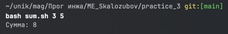
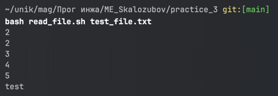
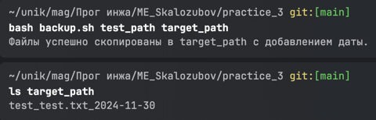
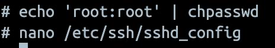
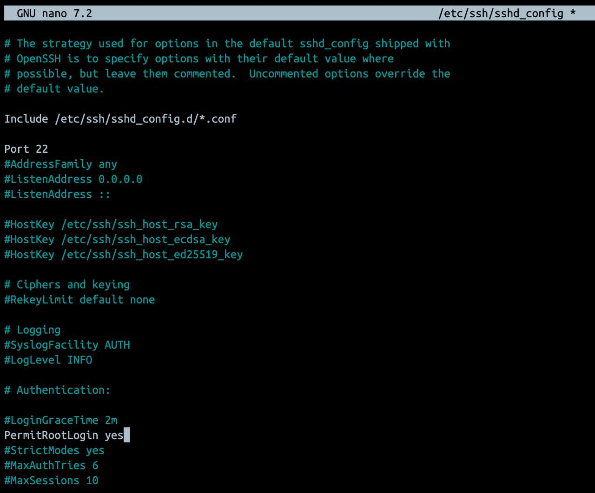
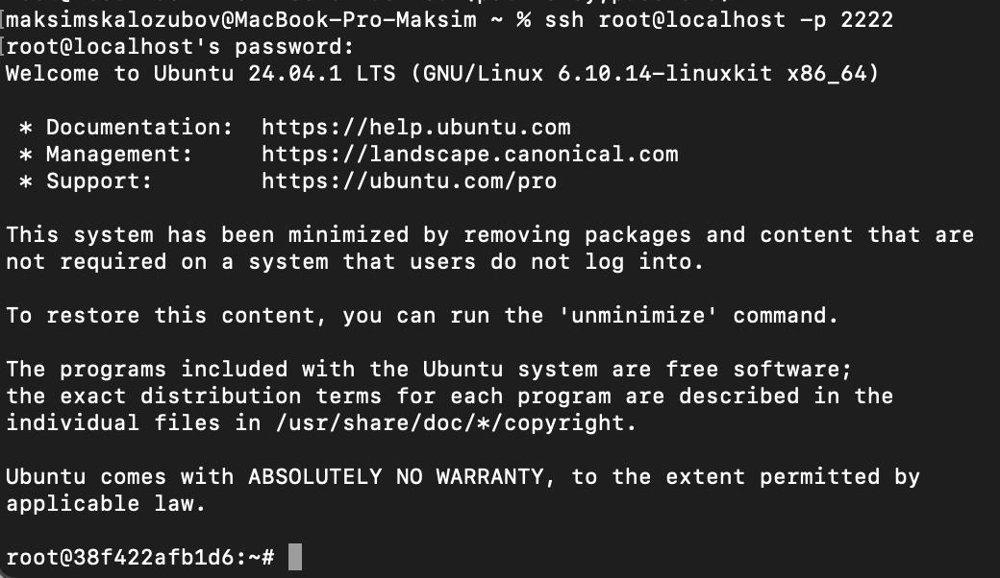
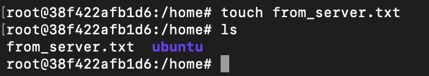
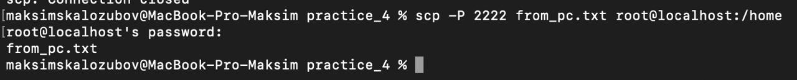
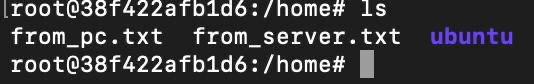
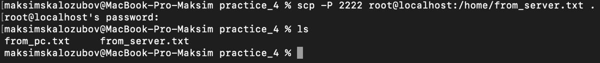

# ME_Skalozubov

## Лабороторная работа 6
Результат выполнения созданных скриптов 3 практики c 1 по 5

check_number.sh

countdown.sh

file_manager.sh

greet.sh

hello.sh

## Лабороторная работа 7
Результат выполнения созданных скриптов 3 практики c 6 по 10

sum.sh

read_file.sh

replace_text.sh

backup.sh

math_operations.sh

## Лабороторная работа 8
Результат выполнения задач 4 практики c 1 по 3

1

Создание контейнера с ubuntu

Установка openssh_server на ubuntu 

Настройка пользователя и пароля и изменения конфига ssh

Запуск ssh сервера

2

Подключаемся по ssh к контейнеру

3

Создаем локально файл и файл в контенере

Выполняем копирование при помощи scp с компьютера на ubuntu в контейнер

Результат копирования

Выполняем копирование при помощи scp с ubuntu в контейнере на компьютер

