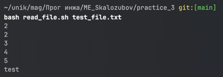
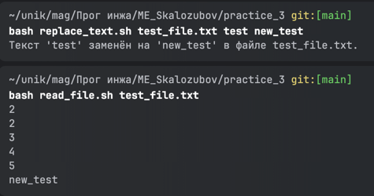
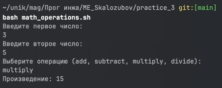

# ME_Skalozubov
## Лабороторная работа 4

## Лабороторная работа к вебинару 6
Результат выполнения созданных скриптов 3 практики c 1 по 5

check_number.sh

countdown.sh

file_manager.sh

greet.sh

hello.sh

## Лабороторная работа к вебинару 7
Результат выполнения созданных скриптов 3 практики c 6 по 10

sum.sh

read_file.sh

replace_text.sh

backup.sh

math_operations.sh
