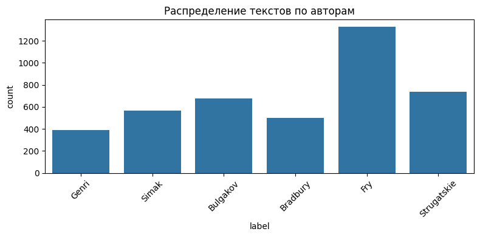
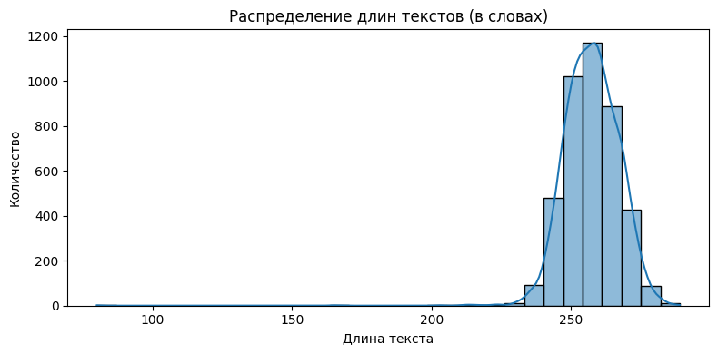
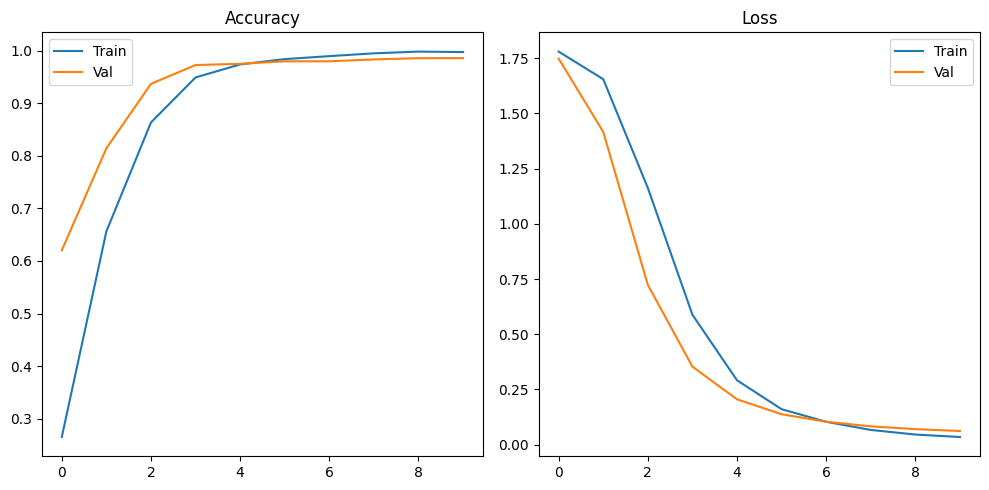
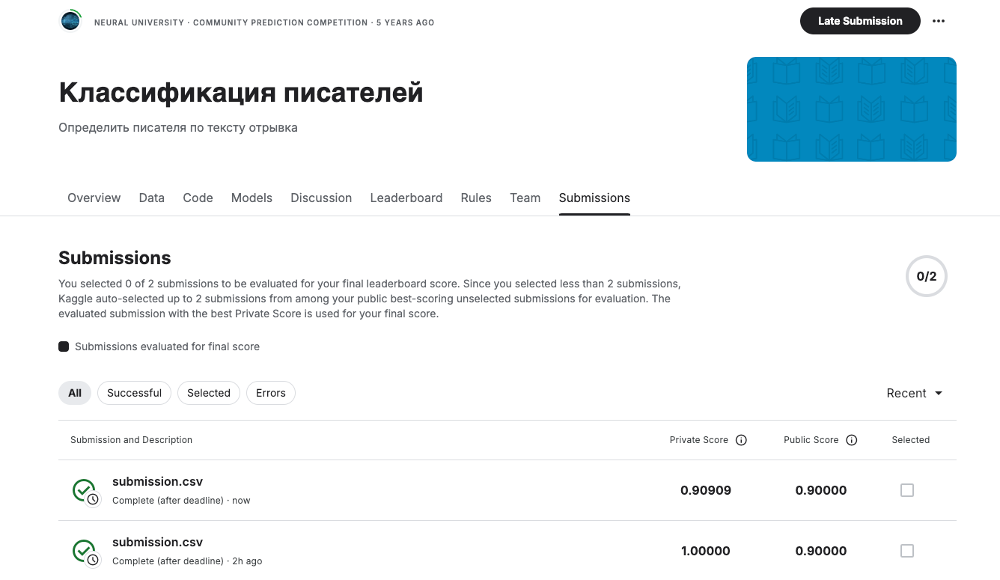

# Классификация писателей

## Цель и задачи
### Цель
Построить модель машинного обучения, способную по отрывку текста корректно определить его автора из заданного списка.

### Задачи
- Очистка и лемматизация текстов, удаление мусорных и служебных слов.
- Векторизация текстов с помощью TF-IDF.
- Обучение нейронной сети-классификатора на полученных признаках.
- Оценка метрик точности на отложенной валидационной выборке.

## Обоснование выбранного подхода
- Обработка данных включает в себя исключение лемматизацию и удаление стоп-слов для уменьшения шума и усиления различия стилей авторов
- Векторизация TF-IDF отличный способ выделить отличительные слова каждого из авторов особенно при работе с текстом с предобработкой. Mаксимальное количество признаков ограниченно 5000 для уменьшения объема данных, а так же используется биграма для учитывания сочетания слов  
- В качестве модели будет использоваться Dense Neural Networks из-за простоты и эффективности при работе с фиксированным размером входных признаков (в моем случае TF-IDF векторами)
  - Используется 3 слоя с уменьшением числа нейронов
  - Используется функция ReLU для активации 
  - Используется регуляризация, чтобы избежать переобучение
  - В качестве выходного слоя Softmax для многоклассовой классификации
  - Из-за того что данные неравномерные добавлены классовые веса, чтобы не было переобучения в сторону классов с большим количеством записей


## Предобработка

```python
def clean_text(text):
    text = text.lower()
    text = re.sub(r"[^а-яa-zё\s]", " ", text)
    text = re.sub(r"\s+", " ", text).strip()
    tokens = text.split()
    tokens = [t for t in tokens if t not in russian_stopwords]
    lemmas = [morph.parse(token)[0].normal_form for token in tokens]
    return " ".join(lemmas)
```

Все тексты переводятся в нижний регистр, удаляются лишние символы и стоп-слова, проводится лемматизация.


## Анализ данных
### Распределение текстов по авторам



Видно, что тексты разных авторов представлены неравномерно (например, Фрай встречается чаще всего), поэтому важно использовать class_weight при обучении модели

### Распределение длин текстов
Во время обработки, тексты разделяются на блоки по 2000 символов



Как мы можем увидеть из картинки тексты имеют длину в среднем 260 слов, что позволяет разбить данные на чанки для дальнейшего обучения

### Анализ частотных и уникальных слов по авторам
```text
Genri: ['сказать', 'это', 'который', 'свой', 'говорить', 'человек', 'один', 'мочь', 'знать', 'такой']
Simak: ['это', 'сказать', 'знать', 'мочь', 'человек', 'который', 'время', 'мы', 'такой', 'говорить']
Bulgakov: ['мольер', 'это', 'который', 'свой', 'человек', 'год', 'сказать', 'говорить', 'стать', 'время']
Bradbury: ['это', 'сказать', 'дуглас', 'рука', 'свой', 'знать', 'человек', 'монтэг', 'который', 'дуга']
Fry: ['это', 'мой', 'сказать', 'свой', 'знать', 'мочь', 'ты', 'который', 'такой', 'просто']
Strugatskie: ['сказать', 'это', 'андрей', 'человек', 'виктор', 'знать', 'свой', 'рука', 'такой', 'румат']
```

### Уникальные слова
```text
Уникальные слова Genri: ['овцевод', 'капсюль', 'запальный', 'тысчонка', 'орешек', 'образцов', 'тосканский', 'вытаскив', 'смышлёность', 'виллабланк']
Уникальные слова Simak: ['вудмане', 'вселе', 'ни', 'выделка', 'макдоналд', 'молль', 'веллингтон', 'наездить', 'шутовство', 'вымуштровать']
Уникальные слова Bulgakov: ['завистниковтечь', 'василий', 'удовый', 'ал', 'демут', 'раздваиваться', 'чугункина', 'хлороформенный', 'усь', 'стегва']
Уникальные слова Bradbury: ['примешиваться', 'волнообразный', 'тить', 'занятно', 'пятипенсовый', 'скукожиться', 'засты', 'тюссо', 'пофыркивание', 'двухтонный']
Уникальные слова Fry: ['бираться', 'прилагаться', 'соул', 'бразилия', 'яв', 'ответствоваль', 'влекаться', 'мариэтта', 'ладненький', 'хайнлайна']
Уникальные слова Strugatskie: ['бама', 'натер', 'воспламенять', 'искоренить', 'вихляться', 'пединститут', 'напористо', 'скворчание', 'двенадцатибалльный', 'похохатывать']
```
У каждого автора присутствует набор уникальных слов - иногда это имена, редкие существительные или словоформы, встречающиеся только у этого писателя. Эти слова становятся отличительными признаками и позволяют модели выделять стиль

### Топ-10 слов по TF-IDF
```text
Genri: ['который', 'свой', 'сказать', 'это', 'говорить', 'мистер', 'доллар', 'гудвино', 'человек', 'деньга']
Simak: ['это', 'сказать', 'мы', 'знать', 'мочь', 'мир', 'телефон', 'человек', 'машина', 'время']
Bulgakov: ['мольер', 'пьеса', 'булгаков', 'николка', 'филипп', 'де', 'король', 'филиппович', 'турбина', 'это']
Bradbury: ['дуглас', 'монтэг', 'дуга', 'это', 'чарли', 'сказать', 'рука', 'глаз', 'дом', 'квотермейн']
Fry: ['это', 'мой', 'джуффин', 'сэр', 'ты', 'просто', 'мочь', 'знать', 'свой', 'сказать']
Strugatskie: ['андрей', 'сказать', 'виктор', 'румат', 'это', 'изя', 'дон', 'человек', 'господин', 'знать']
```
TF-IDF эффективно подчеркивает слова, характерные именно для определенного автора, игнорируя слишком частые, но малозначимые

Все эти особенности формируют уникальные стили авторов


## Модель и её обучение

### Архитектура
```python
def create_tfidf_dense_model(input_dim, num_classes=6, dropout_rate=0.3):
    model = Sequential([
        Input(shape=(input_dim,)),
        Dense(256, activation='relu'),
        Dropout(dropout_rate),
        Dense(128, activation='relu'),
        Dropout(dropout_rate),
        Dense(64, activation='relu'),
        Dense(num_classes, activation='softmax')
    ])
    model.compile(optimizer=Adam(learning_rate=1e-4),
                  loss='sparse_categorical_crossentropy',
                  metrics=['accuracy'])
    return model

```
В финальной версии модели для регуляризации используется Dropout=0.3 после первых двух слоев.
Функция потерь - кросс-энтропия. Оптимизация Adam с шагом 1e-4

Во время обучения были сняты метрики



Модель быстро обучается уже на 3-4 эпохе достаточно высокая точность, переобучения не наблюдается

## Результаты и выводы

Итоговая точность на тренировочной выборке достигает 0.98 - что является отличным результатом

На тестовой выборке при загрузке на проверку в kaggle результат предоставлен на скриншоте


### Возможные улучшения
- Добавить аугментацию
- Увеличить датасет с книгами
- Удаление часто встречающихся, но неинформативных слов
- Более глубокая очистка текста
- Учет частей речи
- Скомбинировать несколько моделей(ансамбль)
- Использование эмбеддингов
- Использование более сложных моделей(например трансформерные архитектуры)


ноутбук можно посмотреть в [classification_of_writers.ipynb](src%2Fclassification_of_writers.ipynb)