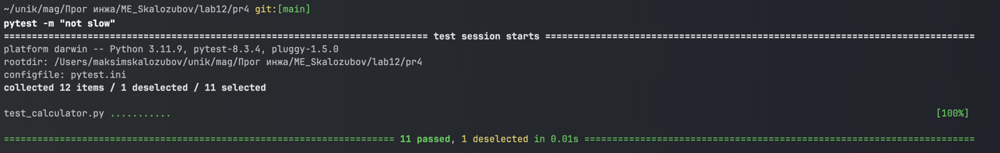

# ME_Skalozubov

## Лабороторная работа 6
Результат выполнения созданных скриптов 3 практики c 1 по 5

https://github.com/vladoky/urfu_seminar/blob/main/Практика/03.practice_bash.pdf

check_number.sh

countdown.sh

file_manager.sh

greet.sh

hello.sh

## Лабороторная работа 7

В лабораторной работе нужно было закрепить навыки работы с Bash.

Выполнить задания, разобранные на вебинарах 7-8.

(То что я прикрепил ранее в лмс случилось из-за недопонимания в этом пункте находится полный отчет)

### Скрипты из вебинара 7

#### Задание 1
Напишите скрипт, который запрашивает у пользователя его имя и возраст,
а затем выводит сообщение

#### Задание 2
Напишите скрипт, который проверяет, существует ли файл,
указанный пользователем. 

#### Задание 3
Скрипт должен создавать архив (tar.gz) для указанной директории.
Имя архива должно включать текущую дату. 

Созданный архив

#### Задание 4
Напишите скрипт, который принимает на вход имя файла
и выводит количество строк в нём.

#### Задание 5
Напишите скрипт, который добавляет префикс backup_ ко всем файлам
в указанной директории.

Папка перед выполнением скрипта

Выполнение скрипта

Результат выполнения

#### Задание 6
Напишите скрипт, удаляющий все файлы в директории,
которые были изменены более 7 дней назад.

#### Задание 7
Создайте скрипт с функцией add, которая принимает два аргумента
и выводит их сумму.

#### Задание 8
Напишите скрипт, который проверяет использование диска
и выводит предупреждение, если использование превышает 80%.

#### Задание 9
Напишите скрипт, который запускает указанную пользователем команду
в фоне и выводит её PID.

### Скрипты из вебинара 8

#### Задание 1
Напишите скрипт, который принимает имя файла и слово для поиска
и выводит количество вхождений этого слова.

#### Задание 2
Напишите скрипт, который принимает два числа и выводит информацию
о том, какое из них больше или меньше, либо о том, что числа равны.

#### Задание 3
Скрипт должен сгенерировать пароль заданной длины,
содержащий буквы и цифры.

#### Задание 4
Напишите скрипт, который пингует сервер и выводит сообщение
о его доступности.

#### Задание 5
Скрипт должен изменить имена всех файлов в директории на строчные буквы.

#### Задание 6
Напишите скрипт, который отслеживает изменение указанного файла
и уведомляет об этом

#### Задание 7
Напишите скрипт для отправки сообщения в Telegram через API.

#### Задание 8
Напишите скрипт, который находит все файлы логов в директории,
сортирует их по времени создания и выводит 5 самых старых
файлов.

#### Задание 9
Напишите скрипт, который запускает несколько команд параллельно
и ждёт их завершения.

#### Задание 10
Скрипт должен реагировать на команды пользователя и выполнять
соответствующие действия. Например, при вводе Дата бот
должен выводить текущую дату.

## Лабороторная работа 8
https://github.com/vladoky/urfu_seminar/blob/main/Практика/03.practice_bash.pdf

Результат выполнения созданных скриптов 3 практики c 6 по 10

sum.sh

read_file.sh

replace_text.sh

backup.sh

math_operations.sh

## Лабороторная работа 9
https://github.com/vladoky/urfu_seminar/blob/main/Практика/04.practice_ssh.pdf

Результат выполнения задач 4 практики c 1 по 3

1

Создание контейнера с ubuntu

Установка openssh_server на ubuntu 

Настройка пользователя и пароля и изменения конфига ssh

Запуск ssh сервера

2

Подключаемся по ssh к контейнеру

3

Создаем локально файл и файл в контенере

Выполняем копирование при помощи scp с компьютера на ubuntu в контейнер

Результат копирования

Выполняем копирование при помощи scp с ubuntu в контейнере на компьютер

## Лабороторная работа 10
#### Задача 1: Настройка SSH-аутентификации по ключу

#### Задача 2: Создание архивов на удаленной машине

#### Задание 3: Перенос файлов и архивов между локальным хостом и удаленной машиной

## Лабороторная работа 11
#### Часть 1 и 2: Подъем PostgreSQL 12 и Запуск Grafana
Был создан compose файл для запуска двух контейнеров

запуск контейнеров

#### Часть 3 и 4: Создание таблицы в PostgreSQL и заполнение данными

#### Часть 5: Подключение Grafana к PostgreSQL и построение дашборда

Добавление конфигурации postgresql

Создание дашборда

Построение графика

## Лабороторная работа 12
### Тестирование pytest
#### Задание 1

#### Задание 2

#### Задание 3

#### Задание 4

#### Задание 5

#### Задание 6

