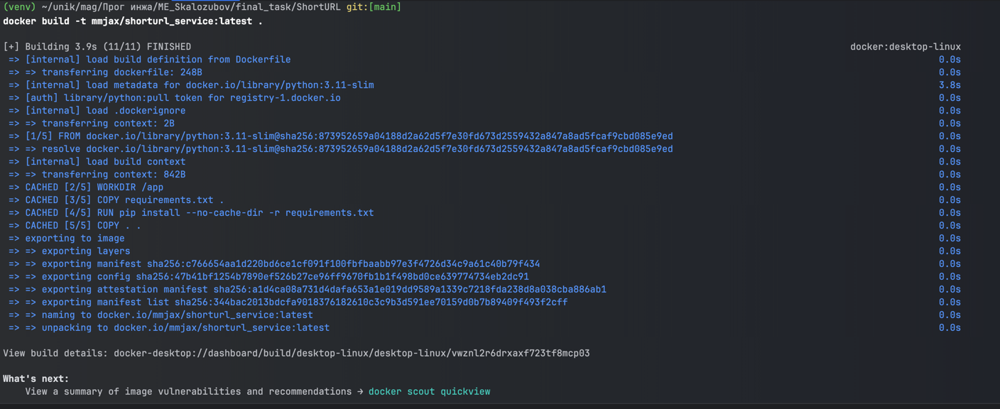
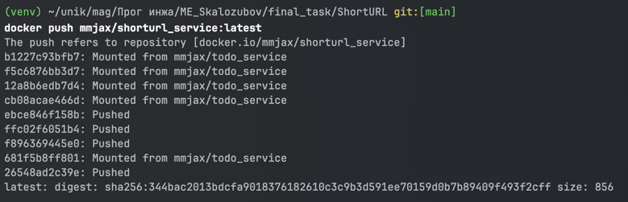

# Итоговое задание

## Задание
### Сервис TODO:
Реализует CRUD-операции для списка задач с
хранением данных в SQLite.
### Сервис сокращения URL (Short URL):
Позволяет создавать
короткие ссылки для длинных URL, перенаправлять по
короткому идентификатору и предоставлять информацию о ссылке. Также хранение данных в SQLite.

Упаковать оба сервиса в Docker-контейнеры, используя
именованные Docker-тома для сохранения данных.
После успешного локального запуска — залить исходный код в
GitHub (в публичный репозиторий).
Собрать образы и опубликовать их на Docker Hub.

## Сервис TODO
Этот проект представляет собой RESTful API для управления пользователями и их задачами (TODO). Сервис реализован на основе **FastAPI**, **SQLAlchemy** и **Pydantic**. Реализована аутентификация пользователей с помощью **JWT**, а также CRUD-операции для задач.

## Возможности

- **Управление пользователями**:
  - Регистрация нового пользователя.
  - Авторизация и получение токена.
  - Обновление данных текущего пользователя.
  - Получение информации о текущем пользователе.

- **Управление задачами**:
  - Создание задачи.
  - Получение списка задач текущего пользователя.
  - Просмотр, обновление или удаление конкретной задачи.

- **Аутентификация**:
  - Используется JSON Web Token (JWT) для безопасного доступа.

---

## Доступные эндпоинты

### Аутентификация

### 1. Регистрация пользователя
- **URL**: `POST /register`
- **Описание**: Регистрирует нового пользователя.
- **Пример тела запроса**:
  ```json
  {
    "username": "testuser",
    "password": "securepassword123",
    "email": "user@example.com",
    "full_name": "Test User"
  }
  ```
- **Пример ответа**:
  ```json
  {
    "username": "testuser",
    "email": "user@example.com"
  }
  ```

### 2. Авторизация пользователя с получением токена
- **URL**: `POST /token`
- **Описание**: Авторизует пользователя и возвращает токен.
- **Пример тела запроса**:
  ```
    username=testuser
    password=securepassword123
  ```
- **Пример ответа**:
  ```json
  {
    "access_token": "eyJhbGc...",
    "token_type": "bearer"
  }
  ```
### 3. Просмотр текущего пользователя
- **URL**: `GET /user_me`
- **Описание**: Предоставляет информацию о текущем пользователе
- **Заголовок**:
  ```
  Authorization: Bearer <access_token>
  ```
- **Пример ответа**:
  ```json
  {
    "username": "string",
    "full_name": "string",
    "id": 1,
    "email": "user@example.com",
    "password": "$2b$12$XyU9NlpdsH7.97Uz5N7RTuvOc9APwIe9aGhLxL6FUMnAYXj29MN52",
    "is_active": true
  }
  ```
### 4. Обновление текщего пользователя
- **URL**: `PATCH /user/update`
- **Описание**: Обновляет текущего пользователя
- **Заголовок**:
  ```
  Authorization: Bearer <access_token>
  ```
- **Пример тела запроса**:
  ```json
  {
    "full_name": "test"
  }
  ```
- **Пример ответа**:
  ```json
  {
    "username": "string",
    "full_name": "test",
    "id": 1,
    "email": "user@example.com",
    "password": "$2b$12$XyU9NlpdsH7.97Uz5N7RTuvOc9APwIe9aGhLxL6FUMnAYXj29MN52",
    "is_active": true
  }
  ```
## Управление задачами

### 1. Создание задачи
- **URL**: `POST /items`
- **Описание**: Создает новую задачу для текущего пользователя.
- **Заголовок**:
  ```
  Authorization: Bearer <access_token>
  ```
- **Пример тела запроса**:
  ```json
  {
    "title": "New Task",
    "description": "Description of the task"
  }
  ```
- **Пример ответа**:
  ```json
  {
    "title": "string",
    "completed": false,
    "id": 1,
    "description": "string",
    "user_id": 1
  }
  ```
  
### 2. Получение списка задач
- **URL**: `GET /items`
- **Описание**: Возвращает список задач текущего пользователя.
- **Заголовок**:
  ```
  Authorization: Bearer <access_token>
  ```
- **Пример ответа**:
  ```json
  [
    {
      "title": "string",
      "completed": false,
      "id": 1,
      "description": "string",
      "user_id": 1
    }
  ]
  ```

### 3. Получение одной задачи
- **URL**: `GET /items/{item_id}`
- **Описание**: Возвращает данные конкретной задачи текущего пользователя.
- **Заголовок**:
  ```
  Authorization: Bearer <access_token>
  ```
- **Пример ответа**:
  ```json
  {
    "title": "string",
    "completed": false,
    "id": 1,
    "description": "string",
    "user_id": 1
  }
  ```

### 4. Обновление задачи
- **URL**: `PUT /items/{item_id}`
- **Описание**: Обновляет информацию о задаче.
- **Заголовок**:
  ```
  Authorization: Bearer <access_token>
  ```
- **Пример тела запроса**:
  ```json
  {
    "title": "Updated Task",
    "description": "Updated description",
    "completed": true
  }
  ```
- **Пример ответа**:
  ```json
  {
    "title": "Updated Task",
    "completed": true,
    "id": 1,
    "description": "Updated description",
    "user_id": 1
  }
  ```

### 5. Удаление задачи
- **URL**: `DELETE /items/{item_id}`
- **Описание**: Удаляет задачу текущего пользователя.
- **Заголовок**:
  ```
  Authorization: Bearer <access_token>
  ```

## Создание образа и запуск контейнера с примером использования
### Создание тома


### Создание образа


### Запуск контейнера


### Страница swagger 


### Пример использования

- Регистрация


- Авторизация с получением токена


- Просмотр текущео пользователя


- Обновление текущего пользователя


- Создание задачи


- Просмотр списка всех задач текущего пользователя


- Просмотр конкретной задачи текущего пользователя


- Попытка просмотра задачи другого пользователя.В таблице существует запись с id = 1, но она пренадлежит другому пользователю


- Обновление задачи текущего пользователя


- Удаление задачи текущего пользователя


## Билд и пуш образа в Dockerhub
- Билд образа


- Пуш образа


https://hub.docker.com/repository/docker/mmjax/todo_service/general

- Запуск с использованием образа из DockerHub


## Сервис сокращения URL (Short URL)
ShortUrl — это сервис для создания сокращенных URL-адресов, управления ими и генерации QR-кодов для сокращенных ссылок. Сервис также поддерживает регистрацию пользователей и авторизацию с использованием токенов.

## Особенности
- Установка срока действия для сокращенных ссылок.
- Удаление устаревших ссылок по расписанию.

## Возможности

- **Управление пользователями**:
  - Регистрация нового пользователя.
  - Авторизация и получение токена.
  - Обновление данных текущего пользователя.
  - Получение информации о текущем пользователе.

- **Управление ссылками**:
  - Создание сокращений URL-адресов.
  - Получение qr-кода сокращенной ссылки.
  - Просмотр, обновление или удаление конкретной ссылки.

- **Аутентификация**:
  - Используется JSON Web Token (JWT) для безопасного доступа.

---

## Доступные эндпоинты

### Аутентификация

### 1. Регистрация пользователя
- **URL**: `POST /register`
- **Описание**: Регистрирует нового пользователя.
- **Пример тела запроса**:
  ```json
  {
    "username": "testuser",
    "password": "securepassword123",
    "email": "user@example.com",
    "full_name": "Test User"
  }
  ```
- **Пример ответа**:
  ```json
  {
    "username": "testuser",
    "email": "user@example.com"
  }
  ```

### 2. Авторизация пользователя с получением токена
- **URL**: `POST /token`
- **Описание**: Авторизует пользователя и возвращает токен.
- **Пример тела запроса**:
  ```
    username=testuser
    password=securepassword123
  ```
- **Пример ответа**:
  ```json
  {
    "access_token": "eyJhbGc...",
    "token_type": "bearer"
  }
  ```
### 3. Просмотр текущего пользователя
- **URL**: `GET /user_me`
- **Описание**: Предоставляет информацию о текущем пользователе
- **Заголовок**:
  ```
  Authorization: Bearer <access_token>
  ```
- **Пример ответа**:
  ```json
  {
    "username": "string",
    "full_name": "string",
    "id": 1,
    "email": "user@example.com",
    "password": "$2b$12$XyU9NlpdsH7.97Uz5N7RTuvOc9APwIe9aGhLxL6FUMnAYXj29MN52",
    "is_active": true
  }
  ```
### 4. Обновление текщего пользователя
- **URL**: `PATCH /user/update`
- **Описание**: Обновляет текущего пользователя
- **Заголовок**:
  ```
  Authorization: Bearer <access_token>
  ```
- **Пример тела запроса**:
  ```json
  {
    "full_name": "test"
  }
  ```
- **Пример ответа**:
  ```json
  {
    "username": "string",
    "full_name": "test",
    "id": 1,
    "email": "user@example.com",
    "password": "$2b$12$XyU9NlpdsH7.97Uz5N7RTuvOc9APwIe9aGhLxL6FUMnAYXj29MN52",
    "is_active": true
  }
  ```

## Управление сокращенными ссылками
### Создание сокращенной ссылки
- **URL**:`POST /shorten`
- **Описание:** Создает сокращенную ссылку.
- **Заголовок**:
  ```
  Authorization: Bearer <access_token>
  ```
- **Пример тела запроса:**
  ```json
  {
    "full_url": "string",
    "expires_at": "datetime (optional)"
  }
  ```
- **Пример ответа:**
  ```json
  {
    "short_url": "string"
  }
  ```

### Переход по сокращенной ссылке
- **URL**:`GET /{short_id}`
- **Описание:** Перенаправляет на оригинальный URL.
- **Пример ответа:** Перенаправление на оригинальный URL.

### Получение статистики
- **URL**:`GET /stats/{short_id}`
- **Описание:** Возвращает статистику по сокращенной ссылке.
- **Пример ответа:**
  ```json
  {
    "id": 1,
    "short_id": "string",
    "full_url": "string",
    "created_at": "datetime",
    "expires_at": "datetime",
    "creator": 1
  }
  ```

### Обновление ссылки
- **URL**:`PATCH /update/{short_id}`
- **Заголовок**:
  ```
  Authorization: Bearer <access_token>
  ```
- **Описание:** Обновляет данные сокращенной ссылки.
- **Пример тела запроса:**
  ```json
  {
    "full_url": "string (optional)",
    "expires_at": "datetime (optional)"
  }
  ```

### Удаление ссылки
- **URL**:`DELETE /delete/{short_id}`
- **Описание:** Удаляет сокращенную ссылку.
- **Заголовок**:
  ```
  Authorization: Bearer <access_token>
  ```
- **Пример ответа:** Без содержимого.

### Дополнительные функции

#### Генерация QR-кода
- **URL**:`GET /qr/{short_id}`
- **Описание:** Возвращает QR-код для сокращенной ссылки.
- **Пример ответа:** Изображение в формате PNG.

---

### Удаление устаревших ссылок
- Автоматическое удаление ссылок с истекшим сроком действия происходит каждую минуту.
- Реализовано с использованием планировщика задач APScheduler.

---
## Создание образа и запуск контейнера с примером использования
### Создание тома


### Создание образа


### Запуск контейнера


### Страница swagger 


### Пример использования

- Регистрация


- Авторизация с получением токена


- Просмотр текущео пользователя


- Обновление текущего пользователя


- Создание сокращенной ссылки

- Переход по ссылке(выполняется редирект с кодом 307)

- Получение информации о сокращенной ссылке

- Обновление ссылки

- Получение qr-кода 

- Демонстрация удаленной ссылки по истечении срока

- Просмотр информации ссылки другого пользователя

- Редирект по ссылке другого пользователя 

- Попытка внести изменение в запись другого пользователя

- Попытка удалить запись другого пользователя


## Билд и пуш образа в Dockerhub
- Билд образа



- Пуш образа



https://hub.docker.com/repository/docker/mmjax/shorturl_service/general

- Запуск с использованием образа из DockerHub


